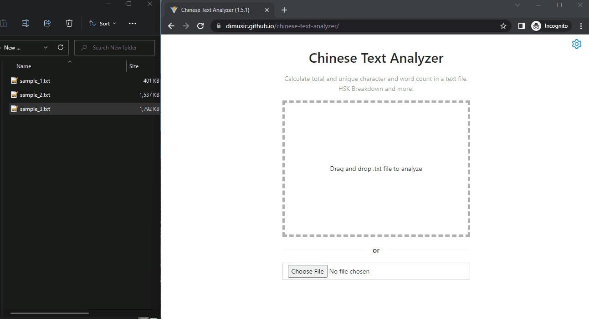

# Chinese Text Analyzer/中文文本分析
Tool to perform simple semantic analysis and gather stats to help measure text comprehension level.
## Usage
Drag and Drop plain text file (.txt) in UTF-8 encoding to the browser window. To analyze a new file repeat drag and drop.

## Features
* Calculates total and unique characters counts in TXT file.
* Calculates total and unique words counts in TXT file using Jieba word segmentation (“结巴”中文分词).
* Provides HSK Breakdown for words in text, including cumulative words frequency per level to gauge text comprehension level.
* Allows exporting lists of unique characters and words for further analysis.
* Allows skipping/including punctuation from analysis.
## Roadmap
* Calculate average amount of characters/words per sentence/paragraph.
* Convert provided TXT file characters set:
  * from Simplified  to Traditional 
  * from Traditional to Simplified
* Additional semantic analysis (i.e. top 10 names/locations/adjectives/verbs in the text).
* Copy analysis results to clipboard
